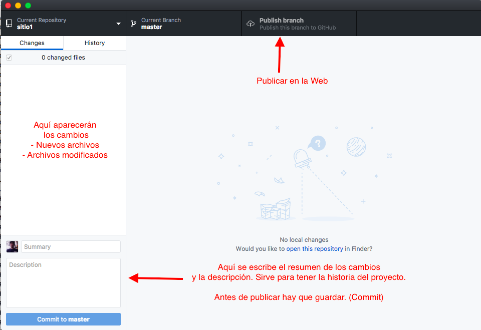
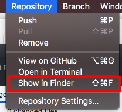
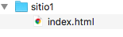
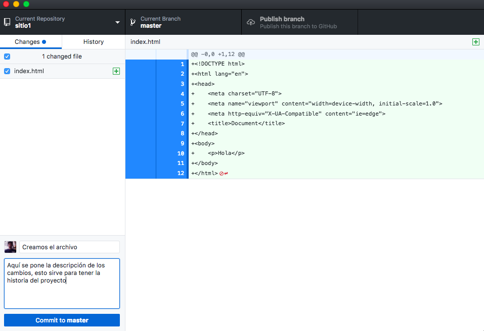
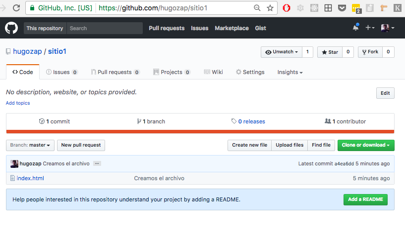
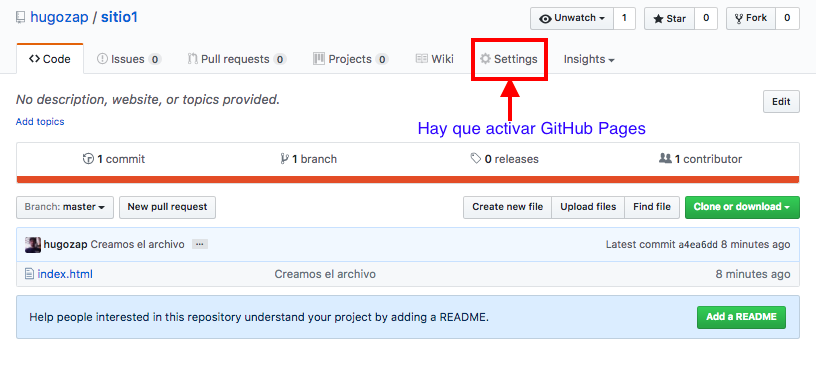
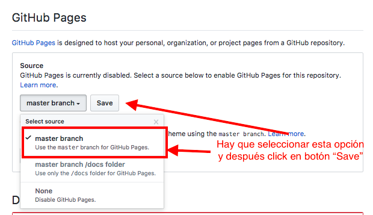

# Usar páginas en GitHub

## Objetivo

Usar el servicio de páginas de GitHub

Pasos:

1. Configurrar GitHub Desktop
2. Crear nuevo proyecto
3. Agregar contenido (local)
4. Subir contenido a Github
5. Activar servicio "Pages"
6. Ver en la Web

## Descargar GitHub Desktop

Para poder trabajar hay que instalar
GitHub Desktop.

[Descargar](https://desktop.github.com/)

## Crear nuevo proyecto

Desde GitHub desktop crear proyecto.

Cuando se crea el proyecto vemos esta pantalla:

### Agregar el primer archivo al proyecto

Vamos a agregar un nuevo archivo "index.html" al proyecto

Pasos:

- Abrir carpeta local del proyecto
- Crear archivo index.html

#### Abrir carpeta del proyecto

Para abrir la carpeta en el menú (Repository) está la opción:

#### Crear archivo dentro de carpeta

Crear archivo index.html

### Subir proyecto a Github

Ahora vamos a subir el proyecto.
( Esto se llama "commit" )

1. Escribir el título y descripción de los cambios al proyecto

2. Publicar los cambios

(Importante: *NO* seleccionar la opción "Keep this code private")

Vamos a revisar si la publicación salió bien.

Ir a Github.com y abrir el proyecto:

Mi proyecto está en :

https://github.com/hugozap/sitio1

(Cambia "hugozap" por tu usuario en GitHub)

### Activar servicio "Pages"

Para poder ver la página tenemos que cambiar la configuración.

Ahora activamos la opción "Pages"

### Ver en la Web

Si funcionó entonces puedes ver tu página en:

[https://github.io/hugozap/sitio1](https://github.io/hugozap/sitio1)

(Tienes que cambiar hugozap por tu usuario de GitHub)

### Hacer cambios

Cuando hagas cambios locales (en tu computador) debes:

En GitHub Desktop

1. Guardar el "commit" con la descripción (Click en "Commit to Master)

2. Publicar tus cambios
(Click en botón "Push to origin")

### Tarea

Ahora ya no vas a usar CodePen.

Crea un nuevo proyecto en Github para tu portafolio.

